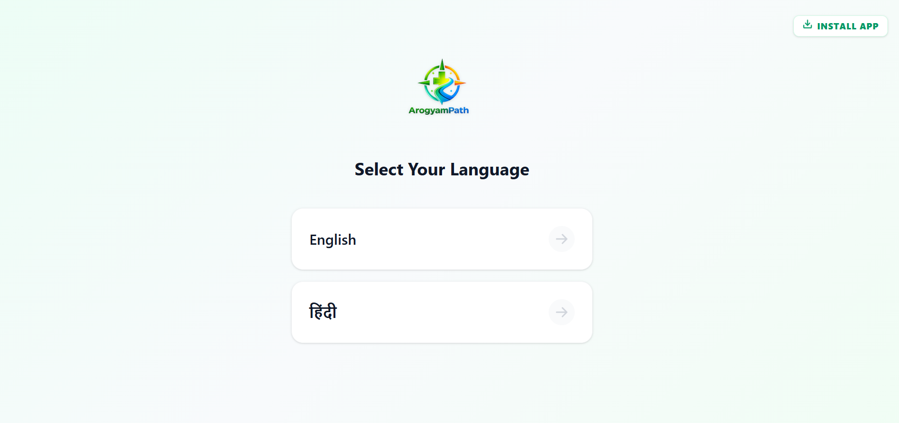
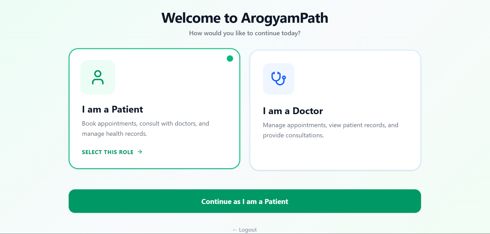
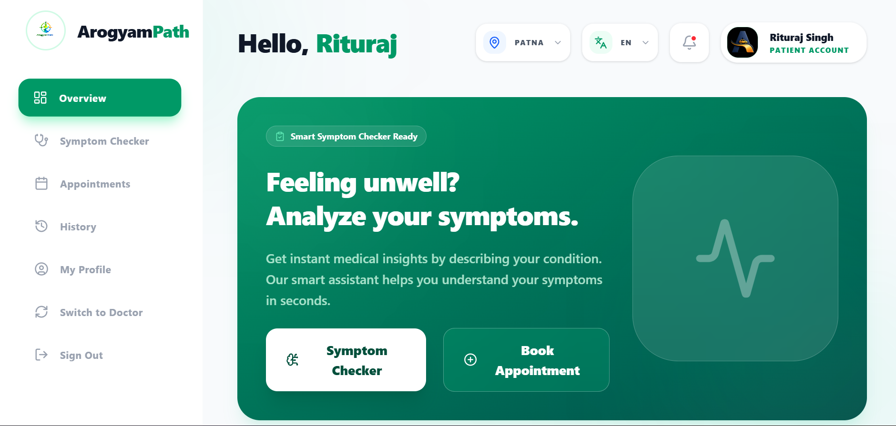
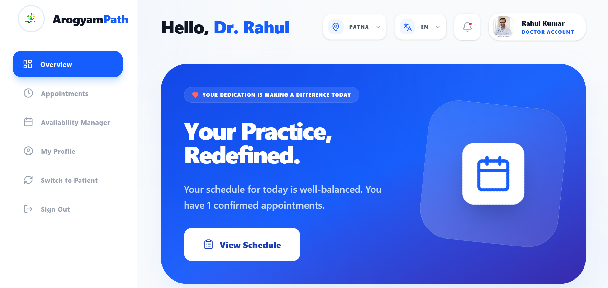

# 🩺 ArogyamPath

### AI-Assisted Patient-Doctor Healthcare Platform

Helping patients understand their symptoms, connect with the right specialists, and book appointments seamlessly—while empowering doctors to efficiently manage appointments, availability, and their daily practice.

🌐 **Live Application:** https://arogyampath.vercel.app

---

# 📖 About ArogyamPath

ArogyamPath is a production-oriented healthcare platform designed to bridge the gap between patients and doctors through a connected digital healthcare ecosystem.

The platform combines AI-assisted symptom guidance, intelligent doctor discovery, appointment booking, video consultations, and comprehensive doctor practice management into a single seamless experience.

Unlike traditional appointment booking applications, ArogyamPath focuses on simplifying the complete healthcare journey—from understanding symptoms to connecting patients with the right medical specialists.

---

# 📸 Visual Walkthrough

### 🚀 1. Welcome & Landing Page
*The entry point introducing ArogyamPath's core healthcare offerings.*

  

---

### 🔑 2. Secure Role Selection
*A clean selection interface enabling users to navigate their respective onboarding paths as either a Patient or a Doctor.*

  

---

### 🏥 3. Patient Dashboard & AI Symptom Assistant
*Equipped with AI symptom detection, doctor lookup, and a history of upcoming appointments.*

  

---

### 👨‍⚕️ 4. Doctor Dashboard & Slots Planner
*Empowering practitioners to manage appointments, configure calendar slots, and view reviews.*

  

---

# ✨ Key Features

## 👤 Patient Portal

- 🤖 AI-Assisted Symptom Guidance
- 🔍 Location & Specialization Based Doctor Search
- 📅 Smart Appointment Booking
- 📹 Secure Video Consultation
- 👨‍👩‍👧 Family Appointment Management
- 📖 Appointment History & Tracking
- 🌐 English & Hindi Support
- 📱 Progressive Web App (PWA)

---

## 👨‍⚕️ Doctor Portal

- 📊 Doctor Dashboard
- 📅 Availability Management
- ⏰ Dynamic Slot Generation
- ☕ Multiple Break Management
- 🏖 Vacation Planning
- 📋 Appointment Management
- ⭐ Patient Ratings & Reviews
- 🔄 Online / Offline Availability

---

# ⚙️ Engineering Highlights

This project was built with a production-oriented mindset rather than as a simple portfolio application.

### 🔐 Secure Role-Based Architecture

- Separate authentication
- Role-based onboarding
- Protected routes
- Dedicated dashboards

---

### 🛡 Transaction-Safe Booking

Implemented Firestore transaction-based distributed locking to eliminate race conditions and prevent double bookings.

---

### 🧠 Hybrid Clinical Decision Support System

Designed an AI-assisted symptom guidance engine with a custom rule-based fallback capable of understanding English and Hinglish symptoms.

---

### 📅 Intelligent Availability Engine

Supports

- Dynamic slot generation
- Multiple break slots
- Vacation mode
- Offline mode
- Conflict detection

---

### 📍 Smart Location Discovery

Integrated Google Maps Places & Geocoding APIs with normalized location handling.

---

### ⚡ Firestore Optimization

- Pagination
- Indexed queries
- Server-side filtering
- Optimized data modeling

---

### 🚀 Performance Optimization

- Lazy Loading
- React.memo
- useMemo
- useCallback
- Error Boundaries

---

# 🛠 Tech Stack

## Frontend

- React 19
- Vite
- Tailwind CSS
- React Router DOM
- Context API
- Lucide React

## Backend & Database

- Firebase Authentication
- Cloud Firestore

## APIs & Integrations

- Google Maps Places API
- Google Geocoding API
- Google Gemini API
- Jitsi Meet API
- Cloudinary API

## Localization

- React-i18next

## PWA

- Vite Plugin PWA
- Workbox

## Deployment

- Vercel

---

# 🎯 Future Roadmap

- AI-powered health insights

- Digital health records

- E-Prescriptions

- Notifications & Reminders

- Enhanced Doctor Verification

- Analytics Dashboard

- Performance Enhancements

---

# 🤝 Contributing

Contributions, ideas, and feedback are always welcome.

---

# 👨💻 Developer

**Swatantra Raj Kumar Singh**

LinkedIn:
(https://linkedin.com/in/swatantra-raj-kumar-singh-39b3a020a)

Email:
(swatantrarajsingh1901@gmail.com)
